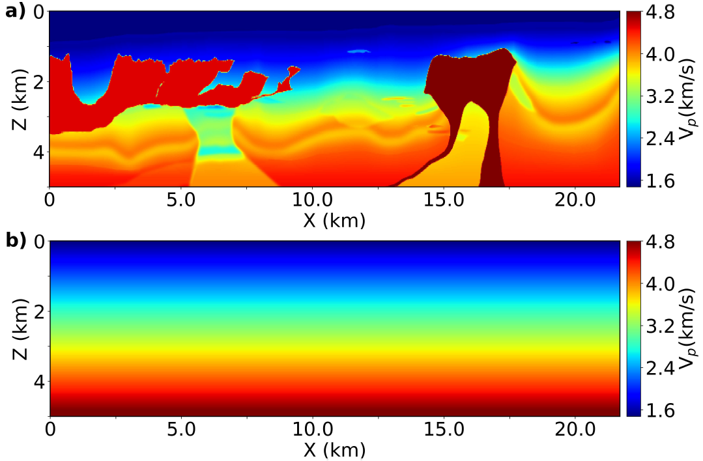
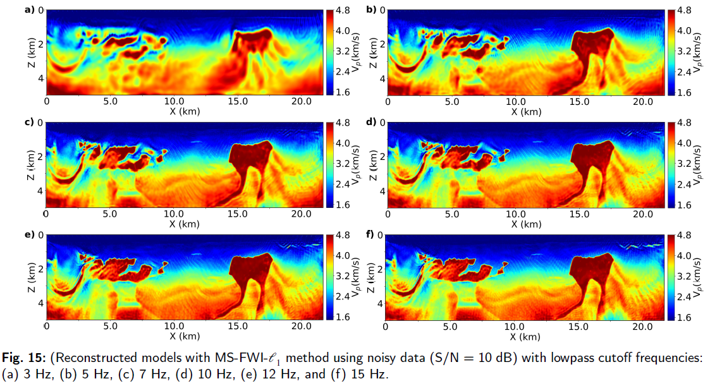
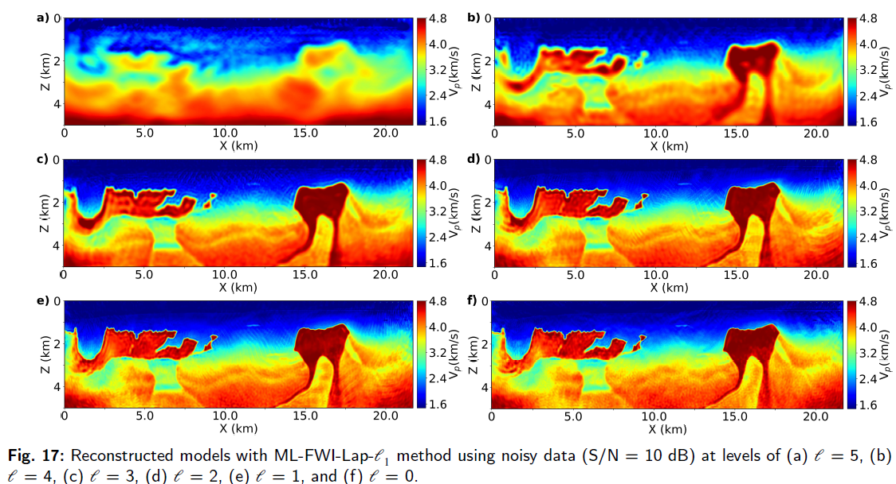
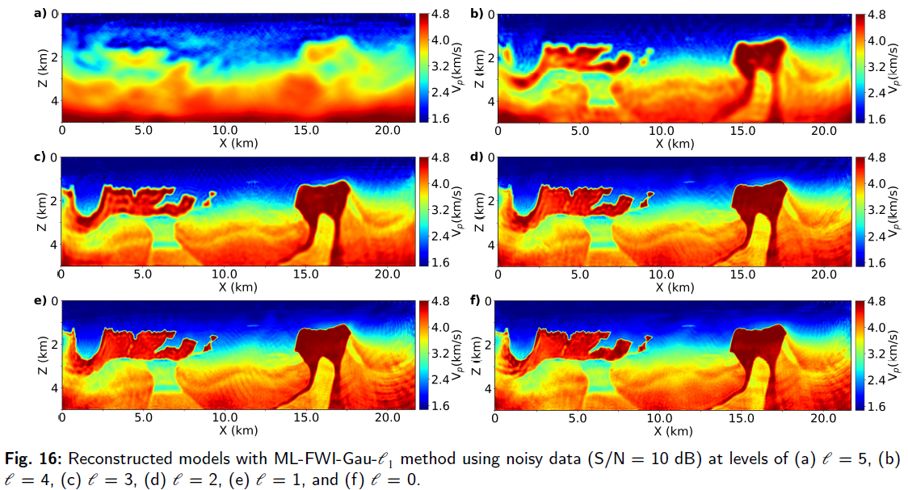

# Multiscale Full Waveform Inversion Using Pyramid Representations

Implementation of two novel multiscale/multilevel time-domain **Full Waveform Inversion (FWI)**
strategies based on **Gaussian** and **Laplacian pyramid** representations, compared against a
conventional frequency-continuation multiscale approach.

---

## Overview

This repository implements two novel multiscale inversion methods for time-domain FWI based on
**Gaussian** and **Laplacian pyramid** representations. Gaussian and Laplacian pyramids generate a set
of low-pass and band-pass representations of the input data, respectively, allowing both observed and
synthetic data to be represented across a hierarchy of frequency scales — higher pyramid levels
emphasize low-frequency information, while lower levels preserve high-frequency components. This
hierarchical structure naturally motivates a coarse-to-fine inversion procedure.

---

## Repository Structure

```
.
├── 01_gen_data.py        # Generates observed data using true model.
├── 02_fwi_ms.py           # Conventional frequency continuation (MS) FWI (low-to-high frequency inversion).
├── 03_fwi_ml_lap.py       # Proposed multilevel FWI based on a **Laplacian pyramid** representation.
├── 04_fwi_ml_gau.py       # Proposed multilevel FWI based on a **Gaussian pyramid** representation.
├── run.sh                 # Convenience script that runs the full pipeline (data generation + inversion).
├── model_data/            # True / initial velocity models
├── tools/                 # Some utility functions
├── asset/                 # Some results folder
├── Notebooks/             # Jupyter notebook versions of the scripts above (exploratory / step-by-step use)
└── README.md
```

Jupyter notebook equivalents of these scripts (`01_gen_data.ipynb`, `02_fwi_ms.ipynb`, `03_fwi_ml_lap.ipynb`,
`04_fwi_ml_gau.ipynb`) are kept in `Notebooks/` for interactive/exploratory use.

## Requirements

- Python 3.+
- PyTorch 2.+
- [Deepwave](https://github.com/ar4/deepwave)
- [pyramid_loss](https://pypi.org/project/pyramid-loss/) — our own package (published on PyPI) implementing the Gaussian/Laplacian pyramid
  decompositions.
- NumPy, SciPy, Matplotlib
- Jupyter Notebook (only needed to run the notebooks under `Notebooks/`)

Hardware used for all experiments in this repository:

- **GPU:** NVIDIA RTX 4090 (24 GB VRAM)

---

## Usage

### Option 1: Quick start (recommended)

```bash
git clone https://github.com/casdhs/Multilevel-FWI.git
cd Multilevel-FWI
bash run.sh
```

`run.sh` runs the full pipeline (data generation + inversion) end-to-end, automatically creating the
`obs_data/`, `source/`, `src_rec_loc/`, `log_data/`, and `rec/` folders and populating them as it runs.

### Option 2: Step by step

1. **Generate data**

   ```bash
   python 01_gen_data.py
   ```

   Builds the true/initial velocity models and simulates observed data.

2. **Run inversion** — choose one:

   ```bash
   python 02_fwi_ms.py       # conventional multiscale
   python 03_fwi_ml_lap.py   # Laplacian-pyramid multilevel
   python 04_fwi_ml_gau.py   # Gaussian-pyramid multilevel
   ```

3. **Inspect results** — inverted models are saved to `rec/`, and inversion logs (loss/error curves) are
   saved to `log_data/`.

> For interactive/exploratory use, the same pipeline is also available as Jupyter notebooks under
> `Notebooks/`.

---

## Results
> Note: Only partial results are shown here.
### True vs Initial Model
<p align="center">
  
</p>

### FWI-MS Results
<p align="center">
  
</p>

### FWI-ML-LAP Results
<p align="center">
  
</p>

### FWI-ML-GAU Results
<p align="center">
  
</p>

If you have any questions, feel free to reach out to faxuanwu@126.com.
